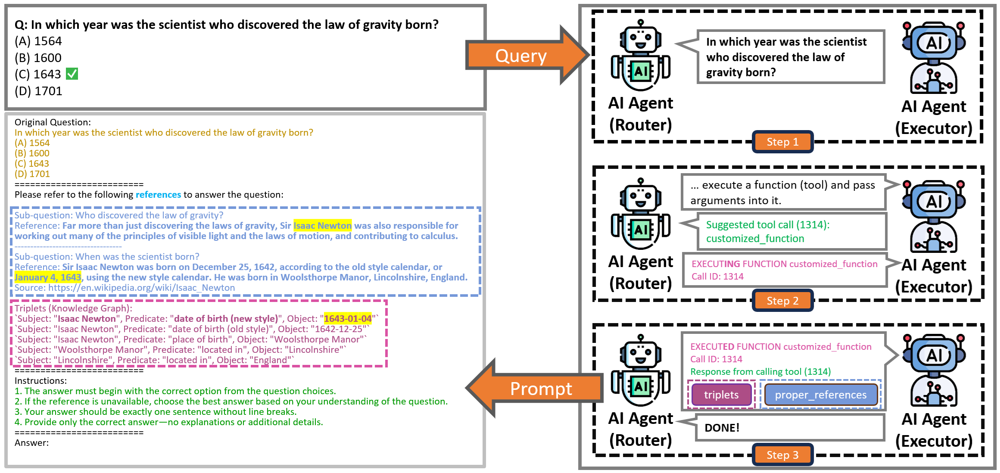
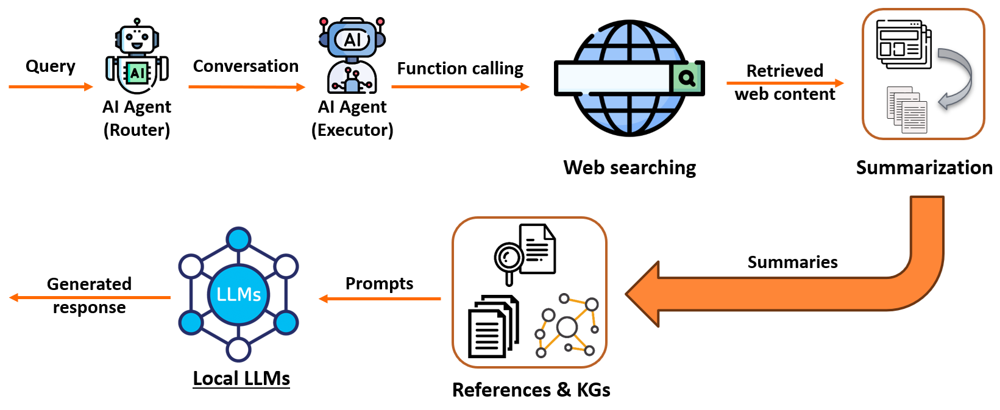
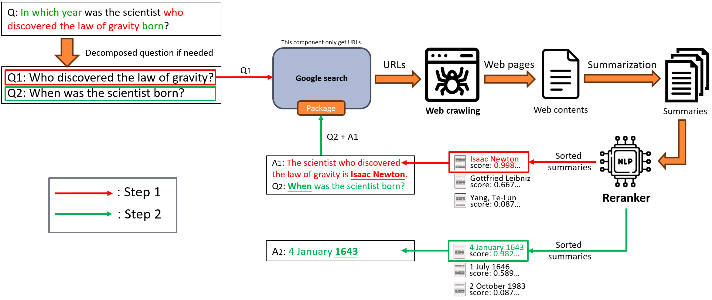
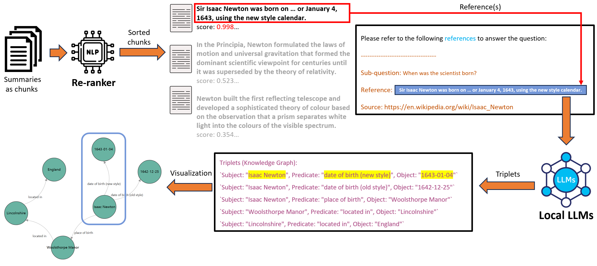
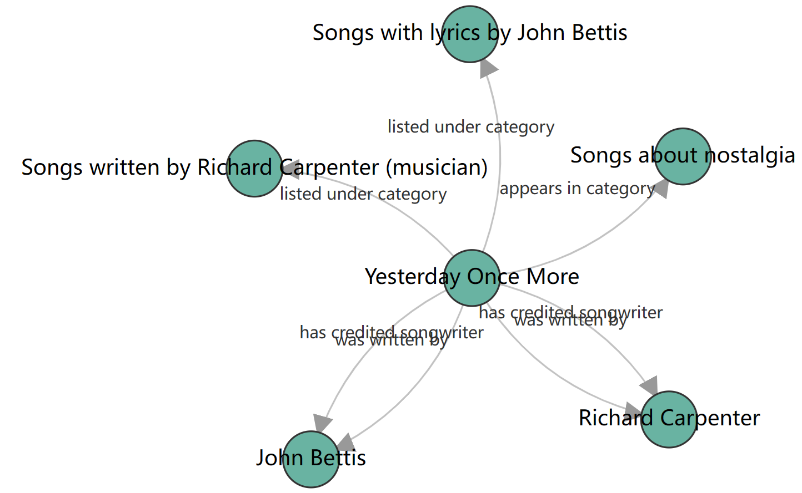

[](https://doi.org/10.5281/zenodo.17240909)

# Agentic Information Retrieval (IR)
- We integrate AI Agents, Reranking, and Knowledge Graphs to build an interactive Information Retrieval pipeline/system. The main goal is to address the issues of opacity, lack of auditability, and even errors in the use of web search functions by AI regarding cited sources.

---

## System Workflow

Figure: The proposed agentic information retrieval pipeline integrates web data acquisition, URL-scoped summarization, reranking, and
knowledge graph construction to enhance the factual accuracy and interpretability of LLM-based responses. The Router and Executor
orchestrate the pipeline by managing user requests, invoking web retrieval tools (web search and URL fetching/parsing), and
coordinating intermediate processing steps. This architecture aims to reduce hallucinations and improve traceability in GenAI
systems.



Figure: Query → Router (plan) → Executor search → fetch/summarize → rerank (over candidate summaries) → top-𝑚 references → triplet extraction → KG → Router (continue or finalize). The example highlights Newton’s birth dates and shows how references plus triples ground the answer selection.



Figure: Pipeline of the recursive information retrieval. A prompted agent first decides whether decomposition is required. Without decomposition, a single iteration of URL-scoped fetching and summarization (into candidate summaries), and single-model reranking is executed, and the top-𝑚 candidate summaries are taken as knowledge references. With decomposition, the agent emits a coherent chain of sub-questions ⟨𝑞1, . . . , 𝑞𝑇 ⟩; at each step 𝑡, the same retrieve–summarization–rerank routine yields references 𝑅𝑡 , a brief intermediate answer 𝑎𝑡 , and 𝑎𝑡 conditions the next step (answer chaining). When the agent stops, the aggregated references Ð𝑡 𝑅𝑡 are provided to the final LLM.



Figure: Select-to-construct knowledge graph from agent-selected references. Starting with the top-𝑚 URL-scoped candidate summaries, we extract (subject, relation, object) triples and attach provenance (URL and sentence span). Duplicate triples are merged. The example illustrates Sir Isaac Newton’s new-/old-style dates of birth and a location chain (Woolsthorpe Manor → Lincolnshire → England).

---

**Please follow the installation process below to install the environment and run the program.**


## Conda Installation
- [Anaconda - Download Now](https://www.anaconda.com/download/success)
```bash
conda create -n agentic_ir python=3.11
conda activate agentic_ir
```

---

## AG2
- [https://docs.ag2.ai/docs/home/home](https://docs.ag2.ai/docs/home/home)

### Packages
```bash
pip install -U ag2[openai,gemini,ollama]
```

---

## Package Installation
```bash
pip install -r requirements.txt
```
Note: We recommend using `cuda 12.1` for better performance with PyTorch and Transformers.
```bash
# $ nvcc -V
nvcc: NVIDIA (R) Cuda compiler driver
Copyright (c) 2005-2023 NVIDIA Corporation
Built on Tue_Feb__7_19:32:13_PST_2023
Cuda compilation tools, release 12.1, V12.1.66
Build cuda_12.1.r12.1/compiler.32415258_0
```

---


## Google Gemini API
- [Google AI Studio - API keys](https://aistudio.google.com/api-keys)

Note: 
- In this project, we use `GOOGLE_API_KEY_01/02/03/04/05` as the environment variable name for Gemini API. Please see `.env-example` for more details and copy it to `.env`.
- After applying for the API, store the API Key in th `.env` file, named as `GOOGLE_API_KEY_{num}=XXXXXXXXXXXXXXXXXXXXXXXXXXXXXXXX`

---

## ollama

### Installation
- [Ollama](https://github.com/ollama/ollama)
- [Ollama Python Library](https://github.com/ollama/ollama-python)
```bash
# ubuntu
curl -fsSL https://ollama.com/install.sh | sh

# windows
# URL: https://ollama.com/download
```

### Optional: set ollama models path

#### Edit ollama.service
```bash
sudo vi /etc/systemd/system/ollama.service
```

#### Set ollama models path
```
[Service]
Environment="OLLAMA_MODELS=/your-path/ollama_models"
```
Note: You can use default path or set your own path.

#### Set keepalive
```
[Service]
Environment="OLLAMA_KEEP_ALIVE=-1"
```

#### Set Host IP and Port
```
[Service]
Environment="OLLAMA_HOST=127.0.0.1:11434"
```

#### Restart ollama
```bash
# Reload system services
sudo systemctl daemon-reload
sudo systemctl restart ollama.service

# Check ollama status
sudo systemctl status ollama.service
```

### Download ollama models
- [Ollama Search - Models](https://ollama.com/search)
```bash
# e.g.
ollama pull mistral-small3.1:24b
ollama pull qwen3:32b
ollama pull llama3.3:70b
ollama pull llama4:16x17b
ollama pull gpt-oss:20b
ollama pull gpt-oss:120b
```
Note: 
- You can change the model names based on your needs.
- The ollama version often updates, please refer to the [Ollama Docs](https://ollama.com/docs) for more details. Otherwise, you may encounter issues when running the ollama-related code or inappropriate model loading.

---

## Playwright Installation
```bash
# All browsers installation
playwright install

# or install specific browsers
playwright install chromium
playwright install firefox
playwright install webkit
```

---

## Google Custom Search API
- [Custom Search JSON API](https://developers.google.com/custom-search/v1/overview)

Note: You need to create a Custom Search Engine and get the API key and Search Engine ID (CX).
- After applying for the API, store the API Key and CX in th `.env` file, named as `SEARCH_API_KEY=XXXXXXXXXXXXXXXXXXXXXX` and `SEARCH_ENGINE_ID=XXXXXXXXXXXXXXXXXXXXXX`

---

## How to run our pipeline

### 1. Launch web api for reranking service
```bash
python web_api_rerank.py
```
Note: Before you run the `run.py` script, please make sure the reranking web api service is running.

#### Example of reranking log
```log
Reranking...
[{'corpus_id': 1,
  'score': 0.9975376129150391,
  'text': 'The opening description states that Yesterday Once More was written '
          'by Richard Carpenter and John Bettis.',
  'url': 'https://en.wikipedia.org/wiki/Yesterday_Once_More_(song)'},
 {'corpus_id': 0,
  'score': 0.25822973251342773,
  'text': 'The song’s credited songwriters are Richard Carpenter and John '
          'Bettis.',
  'url': 'https://en.wikipedia.org/wiki/Yesterday_Once_More_(song)'},
 {'corpus_id': 4,
  'score': 0.04803941026329994,
  'text': 'The song appears in the category Songs about nostalgia, confirming '
          'its authorship by Carpenter and Bettis.',
  'url': 'https://en.wikipedia.org/wiki/Yesterday_Once_More_(song)'},
 {'corpus_id': 2,
  'score': 0.03587467595934868,
  'text': 'The song is listed under the category Songs written by Richard '
          'Carpenter (musician).',
  'url': 'https://en.wikipedia.org/wiki/Yesterday_Once_More_(song)'},
 {'corpus_id': 3,
  'score': 0.010694525204598904,
  'text': 'It is also listed under the category Songs with lyrics by John '
          'Bettis.',
  'url': 'https://en.wikipedia.org/wiki/Yesterday_Once_More_(song)'}]
Reranking took: 0.30 seconds
```

### 2. Launch the main pipeline
```bash
python run.py
```

### 3. Example
Please refer to the following example from [output/who_wrote_a_song_yesterday_once_more](output/who_wrote_a_song_yesterday_once_more/):

**Question**: `Who wrote a song "yesterday once more"?`

**Run log**:
```log
Using model: gpt-oss:120b
Please enter your query: Who wrote a song "yesterday once more"?
router_agent (to executor_agent):

Who wrote a song "yesterday once more"?

--------------------------------------------------------------------------------
executor_agent (to router_agent):

The song was recorded and made famous by the Carpenters, appearing on their 1973 album *Now & Then* and becoming one of their signature hits.

--------------------------------------------------------------------------------
router_agent (to executor_agent):


***** Suggested tool call (ollama_manual_func_7869): get_search_results *****
Arguments: 
{"user_intent": "Identify the songwriters of \"Yesterday Once More\"", "hop_type": "single-hop", "user_query": "Who wrote a song \"yesterday once more\"?", "query": "Who wrote a song \"yesterday once more\"?", "num_results": 3, "model_name": "gpt-oss:120b"}
*****************************************************************************

--------------------------------------------------------------------------------

>>>>>>>> EXECUTING FUNCTION get_search_results...
Call ID: ollama_manual_func_7869
Input arguments: {'user_intent': 'Identify the songwriters of "Yesterday Once More"', 'hop_type': 'single-hop', 'user_query': 'Who wrote a song "yesterday once more"?', 'query': 'Who wrote a song "yesterday once more"?', 'num_results': 3, 'model_name': 'gpt-oss:120b'}
==================================================
Query: Who wrote a song "yesterday once more"?
Getting content from https://en.wikipedia.org/wiki/Yesterday_Once_More_(song)...
Knowledge obtained:
{'q': 'Who wrote a song "yesterday once more"?',
 'summaries': ['The song’s credited songwriters are Richard Carpenter and John '
               'Bettis.',
               'The opening description states that Yesterday Once More was '
               'written by Richard Carpenter and John Bettis.',
               'The song is listed under the category Songs written by Richard '
               'Carpenter (musician).',
               'It is also listed under the category Songs with lyrics by John '
               'Bettis.',
               'The song appears in the category Songs about nostalgia, '
               'confirming its authorship by Carpenter and Bettis.'],
 'url': 'https://en.wikipedia.org/wiki/Yesterday_Once_More_(song)'}
<class 'playwright._impl._errors.TimeoutError'> Search.py 196
Error in Search: Page.goto: Timeout 20000ms exceeded.
Call log:
  - navigating to "https://www.tennessean.com/story/entertainment/music/story-behind-the-song/2014/08/23/story-behind-song-yesterday/14493145/", waiting until "load"

Program execution time: 49.492528438568115 seconds

>>>>>>>> EXECUTED FUNCTION get_search_results...
Call ID: ollama_manual_func_7869
Input arguments: {'user_intent': 'Identify the songwriters of "Yesterday Once More"', 'hop_type': 'single-hop', 'user_query': 'Who wrote a song "yesterday once more"?', 'query': 'Who wrote a song "yesterday once more"?', 'num_results': 3, 'model_name': 'gpt-oss:120b'}
Output:
{"user_intent": "Identify the songwriters of \"Yesterday Once More\"", "hop_type": "single-hop", "user_query": "Who wrote a song \"yesterday once more\"?", "query": "Who wrote a song \"yesterday once more\"?", "model_name": "gpt-oss:120b", "search_results": [[{"q": "Who wrote a song \"yesterday once more\"?", "url": "https://en.wikipedia.org/wiki/Yesterday_Once_More_(song)", "summaries": ["The song’s credited songwriters are Richard Carpenter and John Bettis.", "The opening description states that Yesterday Once More was written by Richard Carpenter and John Bettis.", "The song is listed under the category Songs written by Richard Carpenter (musician).", "It is also listed under the category Songs with lyrics by John Bettis.", "The song appears in the category Songs about nostalgia, confirming its authorship by Carpenter and Bettis."]}]], "proper_knowledge": [{"q": "Who wrote a song \"yesterday once more\"?", "references": [{"corpus_id": 1, "score": 0.9975376129150391, "text": "The opening description states that Yesterday Once More was written by Richard Carpenter and John Bettis.", "url": "https://en.wikipedia.org/wiki/Yesterday_Once_More_(song)"}, {"corpus_id": 0, "score": 0.25822973251342773, "text": "The song’s credited songwriters are Richard Carpenter and John Bettis.", "url": "https://en.wikipedia.org/wiki/Yesterday_Once_More_(song)"}, {"corpus_id": 4, "score": 0.04803941026329994, "text": "The song appears in the category Songs about nostalgia, confirming its authorship by Carpenter and Bettis.", "url": "https://en.wikipedia.org/wiki/Yesterday_Once_More_(song)"}, {"corpus_id": 2, "score": 0.03587467595934868, "text": "The song is listed under the category Songs written by Richard Carpenter (musician).", "url": "https://en.wikipedia.org/wiki/Yesterday_Once_More_(song)"}, {"corpus_id": 3, "score": 0.010694525204598904, "text": "It is also listed under the category Songs with lyrics by John Bettis.", "url": "https://en.wikipedia.org/wiki/Yesterday_Once_More_(song)"}], "triplets": [["Yesterday Once More", "was written by", "Richard Carpenter"], ["Yesterday Once More", "was written by", "John Bettis"], ["Yesterday Once More", "has credited songwriter", "Richard Carpenter"], ["Yesterday Once More", "has credited songwriter", "John Bettis"], ["Yesterday Once More", "appears in category", "Songs about nostalgia"], ["Yesterday Once More", "listed under category", "Songs written by Richard Carpenter (musician)"], ["Yesterday Once More", "listed under category", "Songs with lyrics by John Bettis"]]}]}
executor_agent (to router_agent):

***** Response from calling tool (ollama_manual_func_7869) *****
{"user_intent": "Identify the songwriters of \"Yesterday Once More\"", "hop_type": "single-hop", "user_query": "Who wrote a song \"yesterday once more\"?", "query": "Who wrote a song \"yesterday once more\"?", "model_name": "gpt-oss:120b", "search_results": [[{"q": "Who wrote a song \"yesterday once more\"?", "url": "https://en.wikipedia.org/wiki/Yesterday_Once_More_(song)", "summaries": ["The song’s credited songwriters are Richard Carpenter and John Bettis.", "The opening description states that Yesterday Once More was written by Richard Carpenter and John Bettis.", "The song is listed under the category Songs written by Richard Carpenter (musician).", "It is also listed under the category Songs with lyrics by John Bettis.", "The song appears in the category Songs about nostalgia, confirming its authorship by Carpenter and Bettis."]}]], "proper_knowledge": [{"q": "Who wrote a song \"yesterday once more\"?", "references": [{"corpus_id": 1, "score": 0.9975376129150391, "text": "The opening description states that Yesterday Once More was written by Richard Carpenter and John Bettis.", "url": "https://en.wikipedia.org/wiki/Yesterday_Once_More_(song)"}, {"corpus_id": 0, "score": 0.25822973251342773, "text": "The song’s credited songwriters are Richard Carpenter and John Bettis.", "url": "https://en.wikipedia.org/wiki/Yesterday_Once_More_(song)"}, {"corpus_id": 4, "score": 0.04803941026329994, "text": "The song appears in the category Songs about nostalgia, confirming its authorship by Carpenter and Bettis.", "url": "https://en.wikipedia.org/wiki/Yesterday_Once_More_(song)"}, {"corpus_id": 2, "score": 0.03587467595934868, "text": "The song is listed under the category Songs written by Richard Carpenter (musician).", "url": "https://en.wikipedia.org/wiki/Yesterday_Once_More_(song)"}, {"corpus_id": 3, "score": 0.010694525204598904, "text": "It is also listed under the category Songs with lyrics by John Bettis.", "url": "https://en.wikipedia.org/wiki/Yesterday_Once_More_(song)"}], "triplets": [["Yesterday Once More", "was written by", "Richard Carpenter"], ["Yesterday Once More", "was written by", "John Bettis"], ["Yesterday Once More", "has credited songwriter", "Richard Carpenter"], ["Yesterday Once More", "has credited songwriter", "John Bettis"], ["Yesterday Once More", "appears in category", "Songs about nostalgia"], ["Yesterday Once More", "listed under category", "Songs written by Richard Carpenter (musician)"], ["Yesterday Once More", "listed under category", "Songs with lyrics by John Bettis"]]}]}
****************************************************************

--------------------------------------------------------------------------------

>>>>>>>> TERMINATING RUN (2f1fd436-4efe-4a5c-b5d7-2dea532ed7a4): Maximum turns (2) reached


=== Generated Response ===

Richard Carpenter and John Bettis.

{
  "contribution": {
    "references_pct": 70,
    "triples_pct": 30
  }
}
```

**Prompt**:
```log
Original Question:
Who wrote a song "yesterday once more"?

=========================

Please refer to the following references and triples to answer the question:
----------------------------------
Sub-question: Who wrote a song "yesterday once more"?
Reference: The opening description states that Yesterday Once More was written by Richard Carpenter and John Bettis.
Relevance Score: 0.9975376129150391
Source: https://en.wikipedia.org/wiki/Yesterday_Once_More_(song)
----------------------------------
Sub-question: Who wrote a song "yesterday once more"?
Reference: The song’s credited songwriters are Richard Carpenter and John Bettis.
Relevance Score: 0.25822973251342773
Source: https://en.wikipedia.org/wiki/Yesterday_Once_More_(song)
----------------------------------
Sub-question: Who wrote a song "yesterday once more"?
Reference: The song appears in the category Songs about nostalgia, confirming its authorship by Carpenter and Bettis.
Relevance Score: 0.04803941026329994
Source: https://en.wikipedia.org/wiki/Yesterday_Once_More_(song)
----------------------------------
Sub-question: Who wrote a song "yesterday once more"?
Reference: The song is listed under the category Songs written by Richard Carpenter (musician).
Relevance Score: 0.03587467595934868
Source: https://en.wikipedia.org/wiki/Yesterday_Once_More_(song)
----------------------------------
Sub-question: Who wrote a song "yesterday once more"?
Reference: It is also listed under the category Songs with lyrics by John Bettis.
Relevance Score: 0.010694525204598904
Source: https://en.wikipedia.org/wiki/Yesterday_Once_More_(song)
----------------------------------
Triples (Knowledge Graph): 
`Subject: "Yesterday Once More", Predicate: "was written by", Object: "Richard Carpenter"`
`Subject: "Yesterday Once More", Predicate: "was written by", Object: "John Bettis"`
`Subject: "Yesterday Once More", Predicate: "has credited songwriter", Object: "Richard Carpenter"`
`Subject: "Yesterday Once More", Predicate: "has credited songwriter", Object: "John Bettis"`
`Subject: "Yesterday Once More", Predicate: "appears in category", Object: "Songs about nostalgia"`
`Subject: "Yesterday Once More", Predicate: "listed under category", Object: "Songs written by Richard Carpenter (musician)"`
`Subject: "Yesterday Once More", Predicate: "listed under category", Object: "Songs with lyrics by John Bettis"`


=========================

Notes:
1. The answer must begin with the correct option from the question choices.
2. If the question is multi-choice, choose the best answer (A), (B), (C) or (D) based on your understanding of the question.
3. If the reference knowledges are unavailable or unreasonable, you need to answer with your own understanding.
4. Answer the question in English.
5. After answering the question, output a JSON object named contribution with two integer fields: references_pct and triples_pct.
- Constraints: each is 0–100, and references_pct + triples_pct = 100.
- Do not include additional keys or commentary.
- e.g. "contribution": {"references_pct": percentage, "triples_pct": percentage}

=========================

Answer:
```

**Triples**:


Note: You can set `num_results`(the number of search results) in `run.py` to control the number of search results returned.


